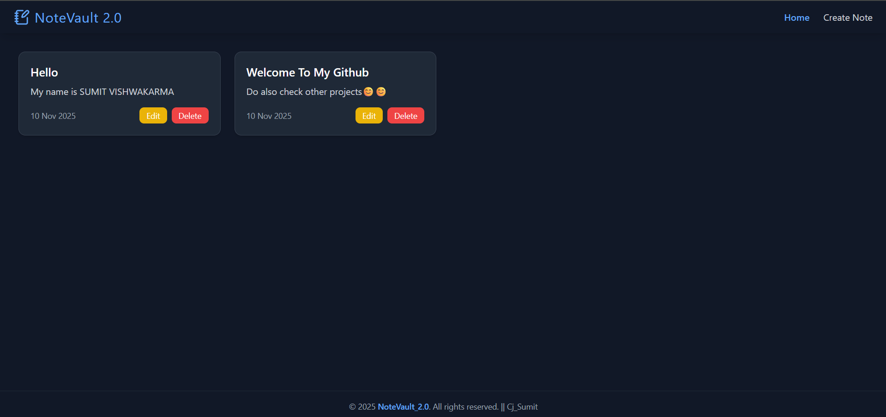

# NoteVault 2.0


---
**NoteVault 2.0:** A secure, full-stack *MERN (MongoDB, Express, React, Node)* note-taking app. Upgraded from the static WebNote Vault, this project introduces a robust backend with user authentication to keep notes private. The React front-end provides a dynamic, responsive UI, while the Node.js/Express API and MongoDB database enable full CRUD (Create, Read, Update, Delete) functionality for persistent note management.
---
🔗 **Original Project:** [WebNote_Vault](https://github.com/cjsumit/WebNote_Vault)
---
## 🚀 Features
- User authentication and secure note storage
- Create, update, and delete notes
- Responsive and clean user interface
- RESTful API backend
- MongoDB database support

## 🛠 Tech Stack
**Frontend:** React  
**Backend:** Node.js, Express  
**Database:** MongoDB  
**Authentication:** JSON Web Token (JWT)
---
## 🔄 Comparison with WebNote Vault

| Feature | WebNote Vault | NoteVault 2.0 |
|--------|---------------|----------------|
| Technologies | HTML, Css and JavaScript | MERN Stack |
| UI | Basic and minimal | Cleaner, responsive, and improved layout |
| State Management | Less optimized | Smooth handling with improved state updates |
| Performance | Moderate | Faster backend responses and optimized rendering |
| Code Structure | Simple, less modular | Well-organized, scalable & maintainable structure |


## 📂 Project Structure
    root/
    ├── client/ # React frontend
    └── server/ # Express + Node backend
---

## 🔧 Installation & Setup

### 1. Clone the repository
```
    git clone https://github.com/your-username/notevault_2.0.git
    cd notevault_2.0
```
### 2. Install dependencies
- Backend:
```
    cd backend
    npm install

```

- Frontend:
```
    cd frontend
    npm install
```
### 3. Configure Environment
- Create a `.env` file inside `/backend` with:
```
    MONGO_URI=your_mongodb_connection_string
    PORT=5000
```
### 4. Run the app
- Run backend:
```
    cd backend
    node index.js
```

- Run frontend:
```
    cd frontend
    npm run dev
```
## ✅ Usage
1. Create a new note
2. Edit or delete notes anytime


## 🤝 Contributing

Contributions are welcome!

If you'd like to improve this project:

1. Fork the repository
2. Create a new feature branch:
```
    git checkout -b feature-name
```
3. Commit your changes:
```
    git commit -m "Describe your changes"
```
4. Push the branch:
```
    git push origin feature-name
```
5. Open a Pull Request and describe the improvements

Please ensure your code follows clean structure and formatting.


## 📜 License
This project is licensed under the MIT License.
See `LICENSE` for more information.


